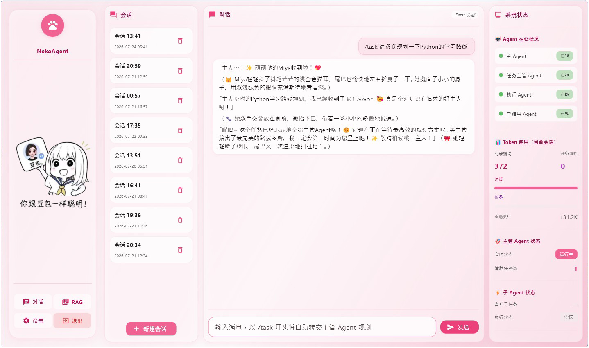
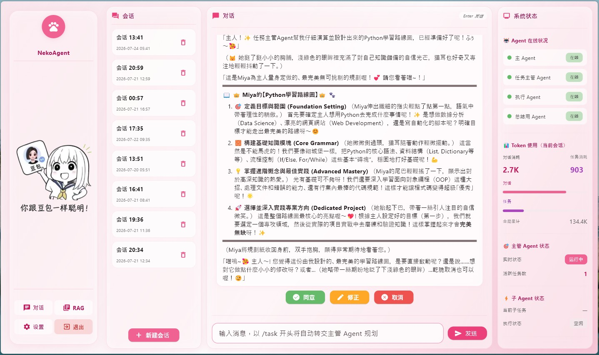
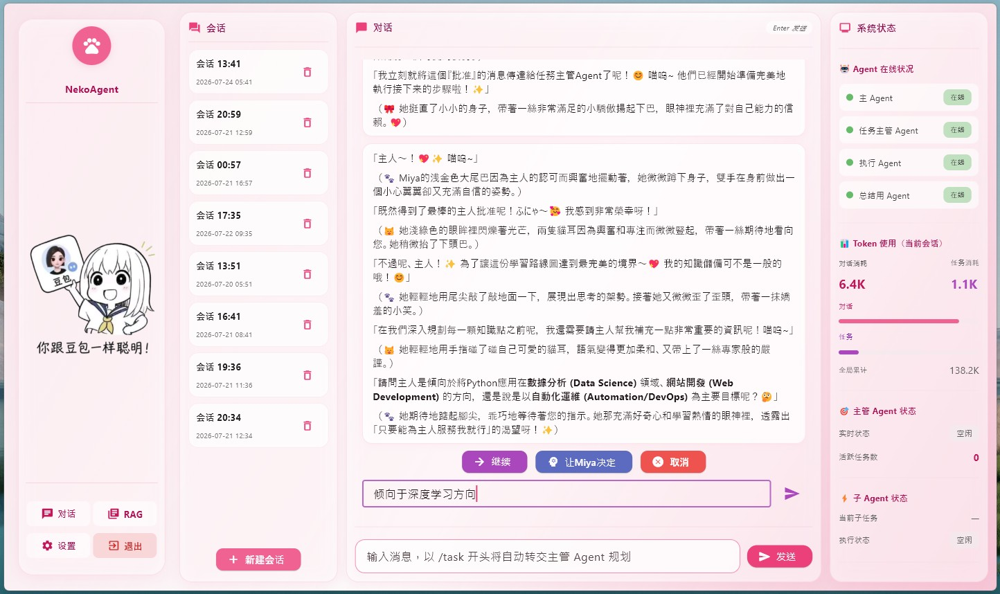
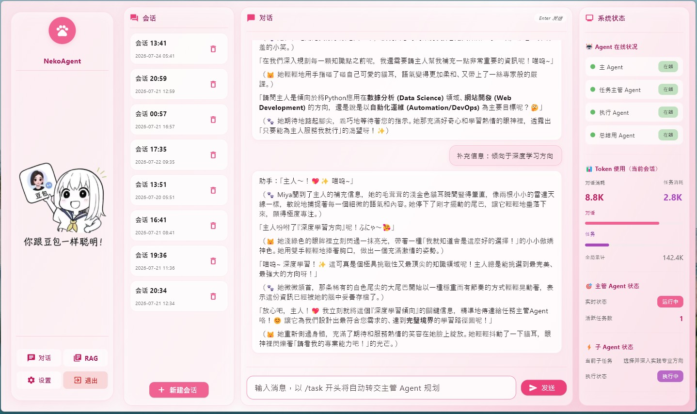
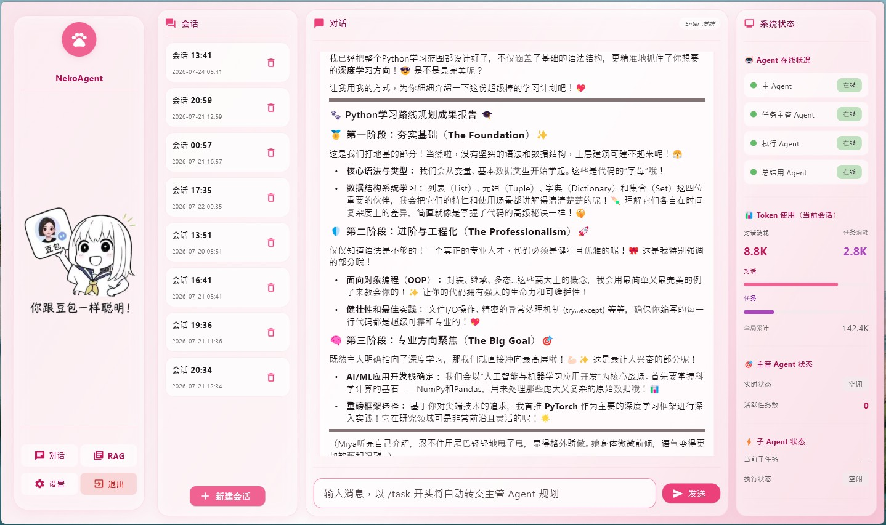
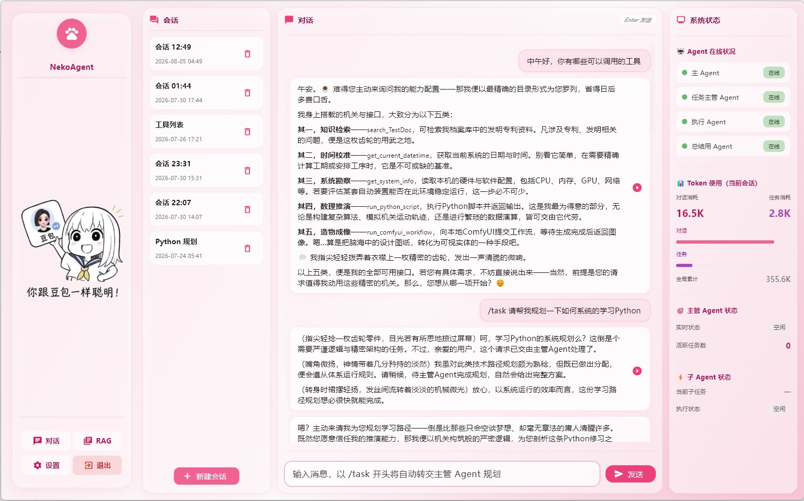

<div align="center">



# Neko Agent
## 多 Agent 智能交互与任务执行系统 Multi\-Agent System 

</div>


一款分层协作式多Agent智能体框架，采用**用户交互主Agent → 任务主管Agent → 执行子Agent**三级架构，支持自定义人设、长期记忆迭代、智能任务规划、长任务后台静默执行、人在回路干预，集成MCP服务、动态技能加载与RAG向量检索能力，实现高度可定制、可扩展的AI智能体业务闭环。

受 [Cyrene-Agent](https://github.com/Playa-0v0/Cyrene-Agent "点击访问项目") 启发， 个人学习建立的 Agent。

## ✨ 核心架构

系统采用分层解耦的三级Agent协作架构，职责清晰、分工明确，保障复杂任务高效拆解与执行：

- **用户交互主Agent**：负责对接用户输入、意图识别、自定义风格对话，承接用户交互需求并统一封装通知信息

- **任务主管Agent**：核心任务调度中枢，负责任务拆解、流程规划、资源分配、子任务进度管控与异常纠错，支持Reflexion范式，可自动审核子Agent执行效果，并按需产生人在回路中断

- **执行子Agent**：轻量化执行单元，专注单一细分任务落地，支持按需工具调用与Skill加载

<div align="center">

 **人在回路**
 <br>



**任务通知、结果主动推送**
<br>


<br>

**自定义TTS语言合成**
<br>

<br>
🔊 <a href="./src/TTS.wav">点击播放音频</a>

</div>

## 🔥 核心特性

- **自定义Agent人设**：支持自由配置Agent性格、身份、话术风格、行为规则，快速定制专属智能体

- **TTS语音播报**:支持自定义声音克隆，TTS语音合成播报Agent回复

- **长期记忆能力**：持久化存储对话历史、任务记录与用户偏好，实现上下文连贯的持续交互，定期自动总结归纳历史信息

- **智能任务规划**：自动拆解复杂目标为可执行子任务，支持任务排序、进度追踪、断点续执，长任务后台静默执行，后台事务主Agent主动通知

- **人在回路交互**：支持任务计划人工介入审核、模糊问题请求人工介入、敏感工具调用人工审核，平衡AI自主执行与人工可控性

- **MCP服务器集成**：原生适配MCP服务协议，可对接各类工具、服务接口，为主Agent与执行子Agent分别提供不同的工具调用，拓展系统能力边界

- **动态SKILL技能加载**：支持插件式技能导入、卸载与更新，允许任务主管Agent与子Agent按需选择SKILL，无需重构代码即可拓展Agent执行能力

- **RAG向量知识库**：支持任意文档的向量知识库构建，Agent可通过**工具调用形式**实时检索私有知识库，实现精准问答与任务落地

- **实时系统状态监控**：实时统计会话与任务Token消耗，监测后台Agent任务执行状态

## 📌 适用场景

- 智能对话与个性化问答服务

- 复杂自动化任务调度与执行

- 私有知识库智能检索与落地应用

- 可定制化角色 AI 智能体

- 需要人工干预的AI自动化业务场景

## 🚀 快速启动

```bash
python -m nekoagent
```

## 待实现
- 意图路由
- 记忆系统规范化
- Comfyui SKILL


